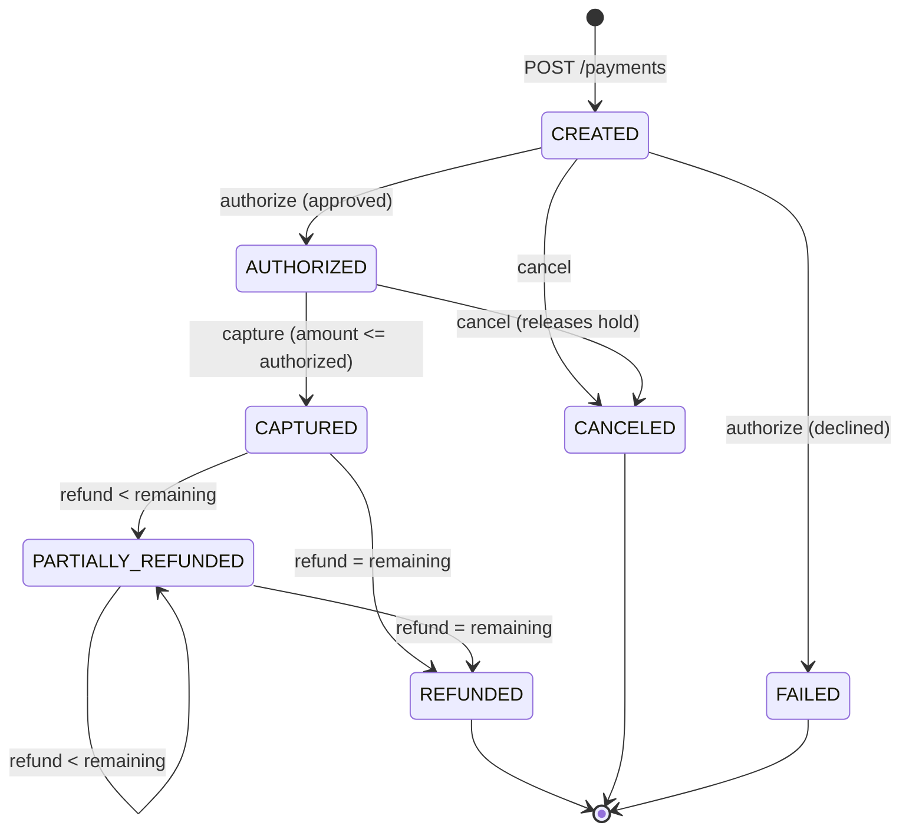
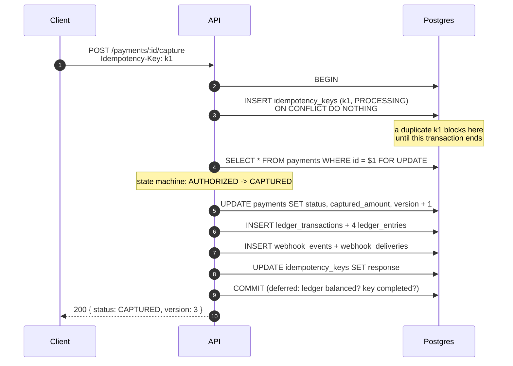
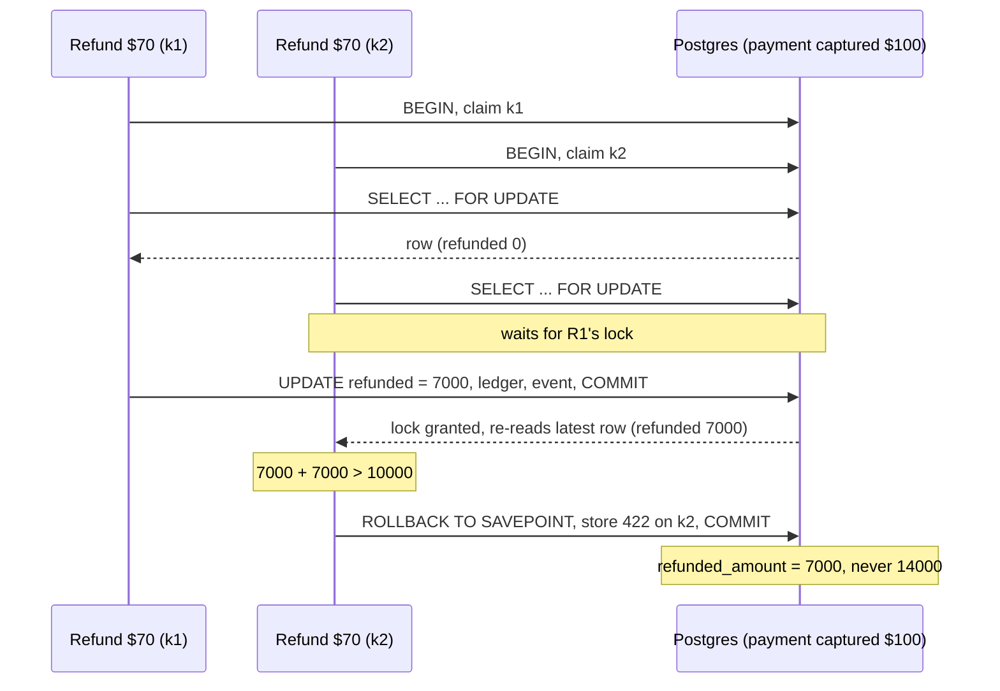
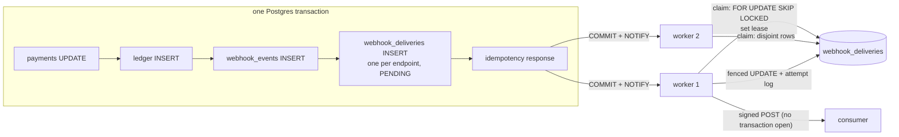
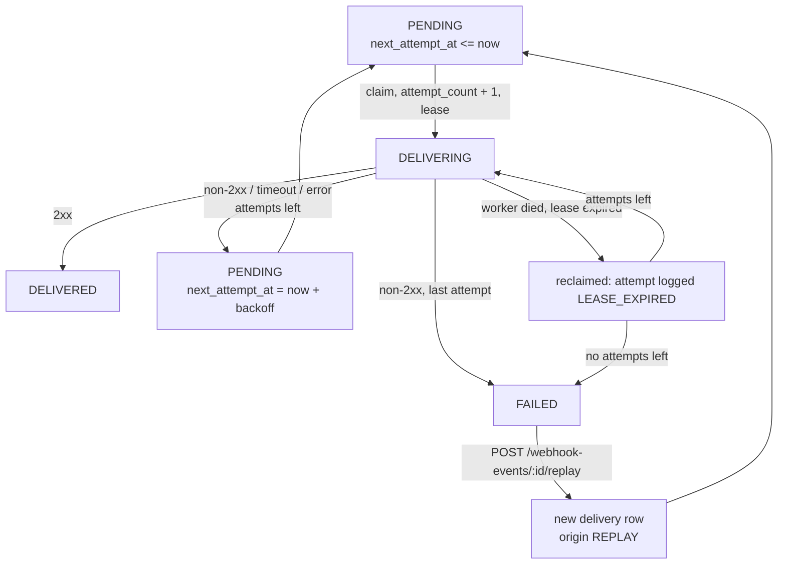
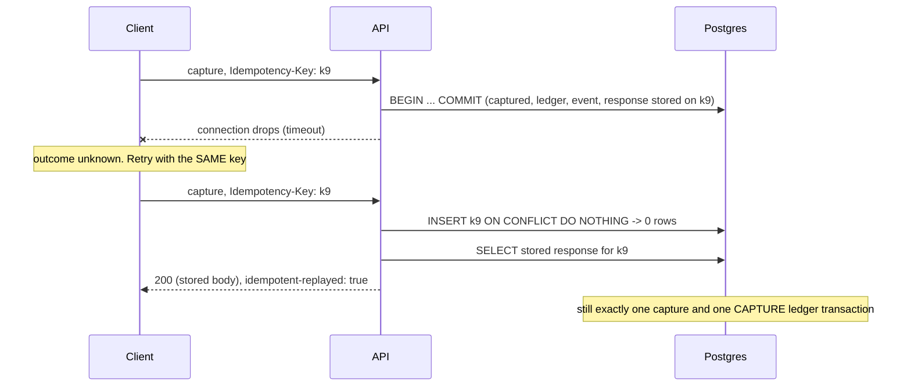
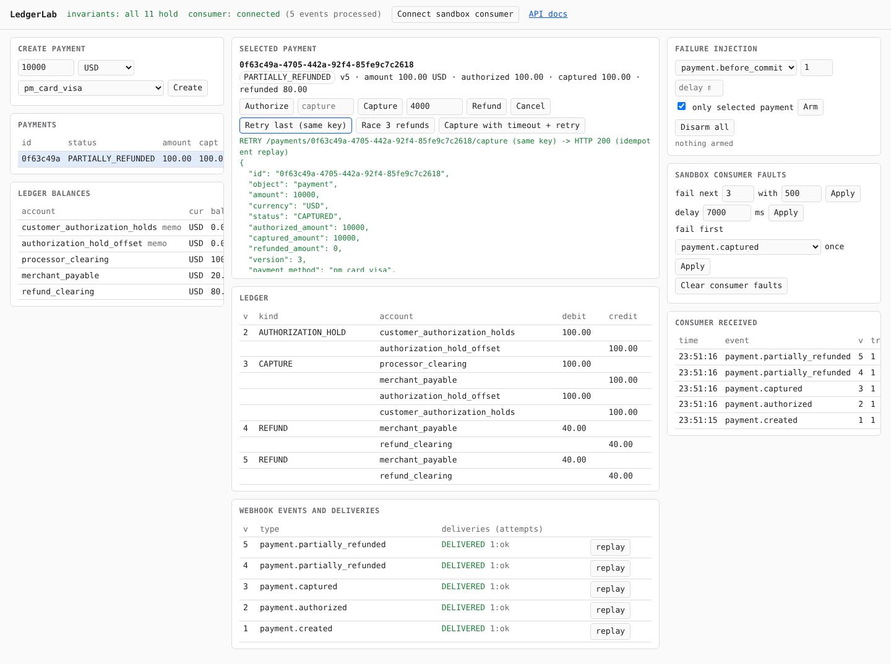

# LedgerLab: Payment Reliability Sandbox

A small payment processor built to show one thing: **financial state stays
correct when requests are duplicated, workers crash, events arrive late, two
operations race, and networks time out.**

It is not a payments product. There is no real card network and no UI worth
looking at. It is a Fastify + PostgreSQL backend where every reliability
claim is backed by a test against a real database, and where the failures
can be switched on and watched.

```
git clone <this repo> && cd ledgerlab
docker compose up -d          # Postgres 16 on :5432
npm install
npm run db:migrate
npm run demo                  # runs Demos A to G end to end and checks the outcomes
npm run dev                   # API on :3000, docs at /docs, dashboard at /dashboard
```

## What it demonstrates

| Problem | Where it is solved | Proof |
|---|---|---|
| Idempotent retries | Idempotency key and the mutation commit in **one** Postgres transaction; duplicates block on the key's primary-key index | 50 concurrent same-key requests: 1 payment, 50 identical responses |
| Double-entry accounting | Append-only journal; `SUM(debits) = SUM(credits)` checked by a deferred trigger at COMMIT | Randomized 3,000-op workload, trial balance and per-payment reconciliation |
| ACID transactions | Payment, refund, ledger, outbox event and idempotent response commit together | Injected rollback leaves no trace of any of them |
| Row locking (pessimistic) | `SELECT ... FOR UPDATE` on the payment | 3 × $40 refunds on $100: always 2 succeed, 1 gets `422` |
| Optimistic concurrency | `WHERE version = $expected` + trigger requiring `version + 1` | Kept as backstops; tested by removing the lock |
| Transactional outbox | Events and deliveries inserted in the payment transaction | A rolled-back capture produces no event |
| Webhook retries, exponential backoff | Lease-based worker, `FOR UPDATE SKIP LOCKED`, equal-jitter backoff | 500s and timeouts retried and logged per attempt |
| Replay | New delivery rows; history is append-only at the DB level | Attempt rows identical before and after replay |
| Eventual consistency | Consumers dedupe on `webhook-id`, order by `payment_version` | Refund webhook before capture webhook: consumer ends at the right state |
| Failure recovery | Expired leases are reclaimed; `attempt_count` is a fencing token | Crash after claim, crash after send, stalled worker |
| Property-based testing | fast-check sequences through the HTTP API vs an independent model | 200+ random sequences per run, all invariants checked after each |

Reading order for a reviewer: this file, then
[docs/transactions.md](docs/transactions.md),
[docs/architecture.md](docs/architecture.md),
[docs/consistency.md](docs/consistency.md),
[docs/webhooks.md](docs/webhooks.md),
[docs/failure-scenarios.md](docs/failure-scenarios.md).

## Payment lifecycle



Every transition increments `version`, writes exactly one outbox event, and
(for authorize, capture, refund and cancel-after-authorize) exactly one
balanced ledger transaction. The graph is a pure function in
[`src/domain/payment-state-machine.ts`](src/domain/payment-state-machine.ts)
and is enforced again by a Postgres trigger; a test checks all 49 status
pairs agree.

## Capture: one transaction



## Refund race: the row lock decides



## Webhook outbox



## Worker retry flow



## Client times out after commit, retries safely



## The ledger

| Event | Debit | Credit |
|---|---|---|
| Authorize $100 | customer_authorization_holds 100 | authorization_hold_offset 100 |
| Capture $80 of $100 | processor_clearing 80, authorization_hold_offset 100 | merchant_payable 80, customer_authorization_holds 100 |
| Refund $30 | merchant_payable 30 | refund_clearing 30 |
| Cancel authorized $100 | authorization_hold_offset 100 | customer_authorization_holds 100 |

Holds are memo accounts that only balance against each other. Reasoning,
alternatives and tradeoffs are in
[docs/architecture.md](docs/architecture.md#double-entry-ledger).

## API

OpenAPI UI at `GET /docs` (JSON at `/docs/json`). Amounts are integers in
minor units. Money-moving endpoints require `Idempotency-Key`.

| Method | Path | |
|---|---|---|
| POST | `/payments` | create (`amount`, `currency`, `payment_method`) |
| GET | `/payments`, `/payments/:id` | |
| POST | `/payments/:id/authorize` | `pm_card_declined` / `pm_card_insufficient_funds` decline |
| POST | `/payments/:id/capture` | optional `amount` |
| POST | `/payments/:id/refunds` | `amount`, optional `reason` |
| POST | `/payments/:id/cancel` | |
| GET | `/payments/:id/refunds`, `/payments/:id/ledger`, `/payments/:id/events` | |
| GET | `/ledger/transactions/:id`, `/ledger/balances`, `/ledger/invariants` | invariants returns 500 if any check fails |
| POST | `/webhook-endpoints`, `/webhook-endpoints/:id/enable`, `/disable` | |
| GET | `/webhook-endpoints`, `/webhook-events`, `/webhook-events/:id` | |
| POST | `/webhook-events/:id/replay` | |
| GET | `/webhook-deliveries`, `/webhook-deliveries/:id` | delivery log with attempts |
| GET | `/health`, `/ready`, `/metrics` | liveness, readiness (DB + migrations), Prometheus counters |
| * | `/dev/*`, `/sandbox/consumer/*`, `/dashboard` | only with `ENABLE_DEV_TOOLS=true` |

Errors are always:

```json
{ "error": { "code": "REFUND_EXCEEDS_CAPTURED_AMOUNT", "message": "Refund would exceed the captured amount.",
             "details": { "captured_amount": 10000, "refunded_amount": 7000, "refundable_amount": 3000, "requested_amount": 7000 } } }
```

## Try it by hand

```bash
H='content-type: application/json'
P=$(curl -s localhost:3000/payments -H "$H" -H 'idempotency-key: demo-1' -d '{"amount":10000,"currency":"USD"}' | jq -r .id)
curl -s -X POST localhost:3000/payments/$P/authorize -H 'idempotency-key: demo-2'
curl -s -X POST localhost:3000/payments/$P/capture   -H 'idempotency-key: demo-3'
# three refunds at once
for k in a b c; do curl -s localhost:3000/payments/$P/refunds -H "$H" -H "idempotency-key: r-$k" -d '{"amount":4000}' & done; wait
curl -s localhost:3000/payments/$P/ledger | jq
curl -s localhost:3000/ledger/invariants | jq .ok
```

Or open `http://localhost:3000/dashboard`: it wires the built-in sandbox
consumer as a webhook endpoint, and every step above (plus failure injection)
is a button.



## Tests

All database tests run against real Postgres; each test file creates and
drops its own database.

```
npm test                    # unit: state machine, postings, signing, backoff, hashing, consumer
npm run test:integration    # API, idempotency, DB constraints, outbox, worker, failure injection
npm run test:concurrency    # racing captures/refunds, same-key storms, commit-then-timeout, worker contention
npm run test:invariants     # fast-check model-based sequences + randomized ledger workload
npm run demo                # Demos A to G with narrated output
```

`PROPERTY_RUNS`, `RANDOM_OPS` and `SEED` scale or pin the randomized suites.
CI (`.github/workflows/ci.yml`) runs lint, typecheck, every suite, the demos
and the build against a Postgres service container.

## Configuration

See [`.env.example`](.env.example). Notable settings: `RUN_WORKER` (embed a
worker in the API process), `WEBHOOK_MAX_ATTEMPTS`,
`WEBHOOK_BACKOFF_BASE_MS`, `WEBHOOK_BACKOFF_MAX_MS`,
`WEBHOOK_HTTP_TIMEOUT_MS`, `WEBHOOK_LEASE_MS` (must exceed the HTTP timeout),
`ENABLE_DEV_TOOLS` (refused when `NODE_ENV=production`). Run extra workers
with `npm run worker`.

## Observability

Structured JSON logs (pino) carry `reqId`, `idempotencyKey`, `paymentId`,
`eventId`, `deliveryId`, `transactionId` (ledger), `workerId` and `attempt`
where relevant. Signing secrets and signature headers are redacted. Every
response has `x-request-id`. `GET /metrics` exposes counters for committed
transitions, rejections, idempotent replays, webhook attempts by outcome,
lease expiries and lost leases.

## Known limitations

Stated plainly, because a reviewer will look for them:

- The card network is simulated in-process. A real one needs multi-phase
  idempotency (see [architecture.md](docs/architecture.md#idempotency)).
- Single capture per payment; no disputes, payouts or settlement.
- Idempotency keys, events and deliveries are never pruned.
- Webhook secrets are stored unencrypted; no secret rotation endpoint.
- No authentication or multi-tenancy; idempotency keys are globally scoped.
- Metrics and failure rules are per process.
